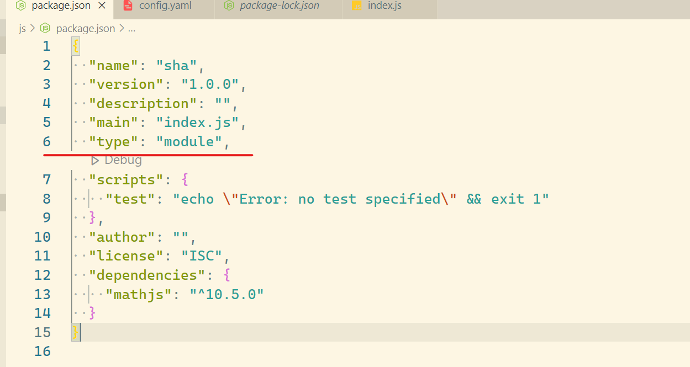

# ECMAScript 6、2016、2017

ECMAScript是JavaScript的规格，JavaScript是ECMAScript的一种实现，在日常场合，这两个词是可以互换的。

JavaScript的创造者Netscape公司，将JavaScript提交给国际标准化组织ECMA，希望这种语言能够成为国际标准，后来ECMA发布标准文件的第一版（ECMA-262），规定了浏览器脚本语言的标准，并将这种语言称为ECMAScript

该标准从一开始就是针对JavaScript语言制定的，之所以不叫JavaScript，有两个原因：一是商标，Java是Sun公司的商标，根据授权协议，只有Netscape公司可以合法地使用JavaScript这个名字，且JavaScript本身也已经被Netscape公司注册为商标；二是想体现这门语言的制定者是ECMA，不是Netscape，有利于保证这门语言的开放性和中立性。

但事实上，JavaScript比ECMA-262的含义多得多，一个完整的JavaScript实现应该由以下三个部分组成：

1) ECMAScript：核心

2) DOM：文档对象模型

3) BOM：浏览器对象模型

## ES6 标准

ES6 入门教程

https://es6.ruanyifeng.com/

Nodejs 入门教程

http://nodejs.cn/learn

### ES6 声明变量的六种方法
ES5 只有两种声明变量的方法：var命令和function命令。ES6 除了添加let和const命令，后面章节还会提到，另外两种声明变量的方法：import命令和class命令。所以，ES6 一共有 6 种声明变量的方法

### 模板字符串 
```js
// 普通字符串
`In JavaScript '\n' is a line-feed.`

// 多行字符串
`In JavaScript this is
 not legal.`

console.log(`string text line 1
string text line 2`);

// 字符串中嵌入变量
let name = "Bob", time = "today";
`Hello ${name}, how are you ${time}?`
```
 
### Babel 转码器
Babel 是一个广泛使用的 ES6 转码器，可以将 ES6 代码转为 ES5 代码，从而在老版本的浏览器执行。这意味着，你可以用 ES6 的方式编写程序，又不用担心现有环境是否支持。下面是一个例子。

# 遇到的问题：


+ (node:5639) Warning: To load an ES module, set "type": "module" in the package.json or use the .mjs extension.

修改

